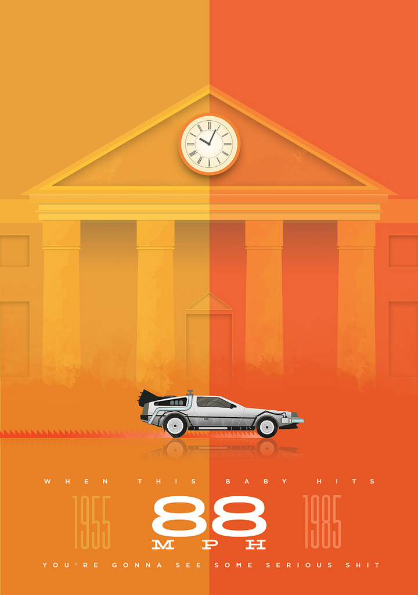

# SP_PPS_2016
Segundo parcial

Nombre de Equipo: 
## Los DeLorean

### Administrador: Marcos Facundo Murcia

### Integrantes:
 
 - Federico Santamaria
 - Juan Giusti
 - Diana Man
 
### URL de Firebase: https://autopistasdelorian-ea30b.firebaseapp.com
### ID de Ionic View: f0de58e3

### Tareas del equipo:
 - Login y Register: Juan Giusti
 - Mapas e Informacion: Federico Santamaria
 - Alta de Denuncias y Feedback: Diana Man
 - Manejo de Servicios: Marcos Facundo Murcia
 
### Pendientes:
 - Denuncias Rapidas:
 - - Boton por cada tipo, manda denuncia segun la posicion, abre modal solo con info adicional.
 
### Progreso:
 - [X] PUSH NOTIFICATIONS!
 - [X] Inicializacion de Servicios Basicos.
 - [X] Login con Google+, Github y Firebase (desde Android).
 - [X] Asignacion de Tokens de registro a Firebase Auth. (No funciono)
 - [X] Login con Google+ y Github desde Web.
 - [X] Completar datos de Factory de Usuario.
 - [X] Usuario guardado en Firebase.
 - [X] Interfaz de Alta de Denuncias.
 - [X] Interfaz de Alta de Reclamos/Sugerencias.
 - [X] Mapa de Denuncias con Markers Personalizados.
 - [X] Sincronizacion de Alta con Mapas en Firebase.
 - [X] Diferenciar contenido accesible por clientes y administradores.
 - [X] Grilla con Denuncias (Solo Administrador).
 - [X] Grilla con Reclamos (Solo Administrador).
 - [X] Graficos de Denuncias (Solo Administrador).
 - [X] Pagina de Autores.
 - [X] Splash + Icono
 
 
